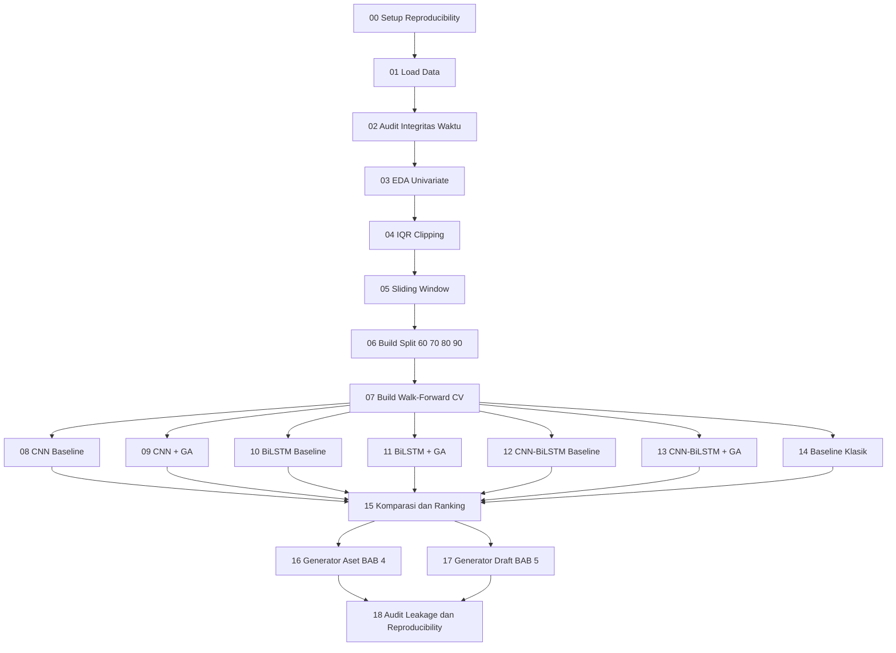
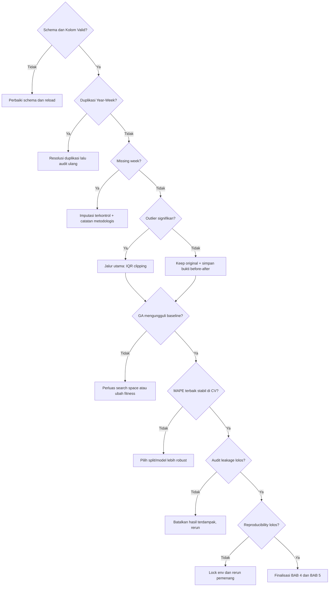
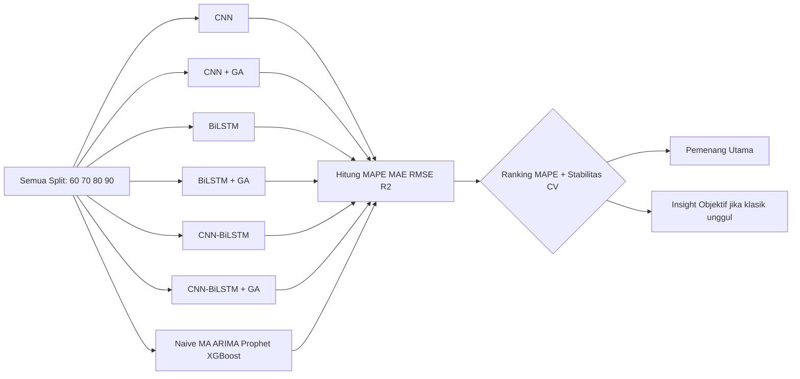
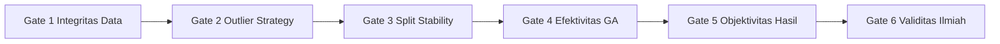

# Pipeline End-to-End TA (Markdown Lengkap)

## 1. Tujuan dan Aturan Main
1. Tujuan utama optimasi model adalah membuat CNN-BiLSTM menjadi kandidat terbaik berdasarkan MAPE.
2. Evaluasi tetap objektif. Jika metode klasik lebih baik, hasil itu tetap dipakai sebagai insight utama.
3. Data yang dipakai adalah univariate murni dengan kolom Year, Week, Grand Total.
4. Semua split wajib dijalankan: 60:40, 70:30, 80:20, 90:10.
5. Semua mode validasi wajib: simple split dan walk-forward CV.
6. Semua model wajib dilaporkan: CNN, CNN+GA, BiLSTM, BiLSTM+GA, CNN-BiLSTM, CNN-BiLSTM+GA.
7. Metrik utama pemilihan pemenang adalah MAPE. Metrik pendamping wajib MAE, RMSE, R².
8. Pipeline wajib lolos audit anti leakage dan reproducibility sebelum kesimpulan final.

---

## 2. Struktur Notebook Baru (Terstruktur, Non-Legacy)
1. Notebook 00 - Project Scope and Reproducibility
2. Notebook 01 - Data Load and Schema Validation
3. Notebook 02 - Time Index Integrity Audit
4. Notebook 03 - EDA Univariate Profile
5. Notebook 04 - Outlier Handling IQR Clipping
6. Notebook 05 - Sliding Window Supervised Framing
7. Notebook 06 - Split Builder for All Ratios
8. Notebook 07 - Walk-Forward CV Builder
9. Notebook 08 - CNN Baseline All Splits
10. Notebook 09 - CNN + GA All Splits
11. Notebook 10 - BiLSTM Baseline All Splits
12. Notebook 11 - BiLSTM + GA All Splits
13. Notebook 12 - CNN-BiLSTM Baseline All Splits
14. Notebook 13 - CNN-BiLSTM + GA All Splits
15. Notebook 14 - Traditional Baselines All Splits
16. Notebook 15 - Comprehensive Comparison and Ranking
17. Notebook 16 - BAB 4 Assets Generator
18. Notebook 17 - BAB 5 Draft Generator
19. Notebook 18 - Leakage and Reproducibility Audit

---

## 2.1 Visualisasi Alur Utama Pipeline

## 2.2 Visualisasi Percabangan Keputusan

## 2.3 Visualisasi Percabangan Model dan Split

---

## 3. Pipeline Eksekusi Detail per Fase

## Fase A - Fondasi Data dan Eksperimen
### Notebook 00 - Project Scope and Reproducibility
Input: requirement riset, hardware, software, seed.
Proses: lock random seed, catat versi library, catat info GPU, buat struktur folder output.
Output: metadata eksperimen.
Checklist:
- [x] Seed global ditetapkan.
- [x] Versi environment dicatat.
- [x] Struktur output hasil dibuat.
- [x] Format log eksperimen ditetapkan.

### Notebook 01 - Data Load and Schema Validation
Input: satu file Excel final.
Proses: load data, verifikasi kolom wajib, verifikasi tipe data.
Output: dataset valid awal.
Checklist:
- [x] Kolom Year ada.
- [x] Kolom Week ada.
- [x] Kolom Grand Total ada.
- [x] Jumlah baris terbaca dengan benar.

### Notebook 02 - Time Index Integrity Audit
Input: dataset valid awal.
Proses: cek duplikasi Year-Week, cek missing week, cek urutan temporal, cek missing value.
Output: laporan audit integritas data.
Checklist:
- [x] Tidak ada duplikasi Year-Week.
- [x] Tidak ada missing value target.
- [x] Urutan waktu valid.
- [x] Jumlah minggu konsisten dengan horizon data.

### Notebook 03 - EDA Univariate Profile
Input: dataset lolos audit integritas.
Proses: statistik deskriptif, line plot, histogram, boxplot, pola umum.
Output: aset visual karakteristik data.
Checklist:
- [x] Statistik ringkas tersedia.
- [x] Plot tren waktu tersedia.
- [x] Plot distribusi tersedia.
- [x] Plot boxplot tersedia.
- [x] Insight data tertulis.

### Notebook 04 - Outlier Handling IQR Clipping
Input: dataset hasil EDA.
Proses: hitung Q1, Q3, IQR, clipping, before-after analysis.
Output: dataset cleaned + ringkasan perubahan.
Checklist:
- [ ] Nilai batas IQR tercatat.
- [ ] Jumlah outlier tercatat.
- [ ] Perbandingan before-after ada.
- [ ] Dataset cleaned tersimpan.

### Notebook 05 - Sliding Window Supervised Framing
Input: dataset cleaned univariate.
Proses: bentuk pasangan X,y dengan tau = 8 dan horizon = 1.
Output: dataset supervised.
Checklist:
- [ ] Window size sesuai.
- [ ] Horizon sesuai.
- [ ] X dan y terbentuk valid.
- [ ] Tidak ada shuffle temporal.

### Notebook 06 - Split Builder for All Ratios
Input: dataset supervised.
Proses: buat split 60:40, 70:30, 80:20, 90:10.
Output: artefak train-test per rasio.
Checklist:
- [ ] Split 60:40 selesai.
- [ ] Split 70:30 selesai.
- [ ] Split 80:20 selesai.
- [ ] Split 90:10 selesai.
- [ ] Ringkasan ukuran sample tersimpan.

### Notebook 07 - Walk-Forward CV Builder
Input: train set dari tiap split.
Proses: bentuk fold walk-forward untuk validasi temporal.
Output: artefak fold CV.
Checklist:
- [ ] Fold CV tiap split terbentuk.
- [ ] Urutan temporal terjaga.
- [ ] Tidak ada fold leakage.

---

## Fase B - Eksperimen Model Deep Learning
### Notebook 08 - CNN Baseline All Splits
Input: semua split.
Proses: train CNN baseline, evaluasi test.
Output: tabel metrik CNN.
Checklist:
- [ ] Training CNN per split selesai.
- [ ] MAPE per split ada.
- [ ] MAE per split ada.
- [ ] RMSE per split ada.
- [ ] R² per split ada.

### Notebook 09 - CNN + GA All Splits
Input: semua split.
Proses: tuning hyperparameter CNN dengan GA search space diperluas, retrain kandidat terbaik.
Output: tabel trial GA dan hasil terbaik CNN+GA.
Checklist:
- [ ] Search space GA terdokumentasi.
- [ ] Trial GA per split tersimpan.
- [ ] Kandidat terbaik per split tersimpan.
- [ ] Metrik final CNN+GA per split tersedia.

### Notebook 10 - BiLSTM Baseline All Splits
Input: semua split.
Proses: train BiLSTM baseline, evaluasi test.
Output: tabel metrik BiLSTM baseline.
Checklist:
- [ ] BiLSTM baseline per split selesai.
- [ ] MAPE, MAE, RMSE, R² lengkap.

### Notebook 11 - BiLSTM + GA All Splits
Input: semua split.
Proses: tuning BiLSTM pakai GA, retrain kandidat terbaik.
Output: tabel trial GA dan hasil BiLSTM+GA.
Checklist:
- [ ] Search space GA diperluas.
- [ ] Trial tersimpan.
- [ ] Hasil terbaik per split ada.
- [ ] Metrik final lengkap.

### Notebook 12 - CNN-BiLSTM Baseline All Splits
Input: semua split.
Proses: train hybrid baseline, evaluasi test.
Output: tabel metrik CNN-BiLSTM baseline.
Checklist:
- [ ] Hybrid baseline per split selesai.
- [ ] Metrik lengkap tersedia.

### Notebook 13 - CNN-BiLSTM + GA All Splits
Input: semua split.
Proses: tuning hybrid pakai GA, retrain model terbaik.
Output: tabel trial GA dan hasil final model target.
Checklist:
- [ ] Search space GA hybrid diperluas.
- [ ] Trial GA per split ada.
- [ ] Best hyperparameter per split ada.
- [ ] MAPE final per split tersedia.

---

## Fase C - Baseline Klasik dan Komparasi Final
### Notebook 14 - Traditional Baselines All Splits
Input: semua split.
Proses: jalankan Naive, Moving Average, ARIMA, Prophet, XGBoost.
Output: tabel metrik baseline klasik.
Checklist:
- [ ] Naive selesai.
- [ ] Moving Average selesai.
- [ ] ARIMA selesai.
- [ ] Prophet selesai.
- [ ] XGBoost selesai.
- [ ] Metrik lengkap semua model tersedia.

### Notebook 15 - Comprehensive Comparison and Ranking
Input: seluruh tabel hasil model deep learning dan klasik.
Proses: gabung hasil, ranking lintas model berdasarkan MAPE, analisis kestabilan antar split.
Output: ranking final dan pemenang objektif.
Checklist:
- [ ] Tabel komparasi final tersedia.
- [ ] Ranking final by MAPE tersedia.
- [ ] Analisis split terbaik tersedia.
- [ ] Insight objektif tercatat.

---

## Fase D - Packaging Laporan BAB 4 dan BAB 5
### Notebook 16 - BAB 4 Assets Generator
Input: hasil dari notebook 03 sampai 15.
Proses: generate tabel dan grafik untuk sub-bab BAB 4.
Output: aset siap tempel ke BAB 4.
Checklist:
- [ ] Asset BAB 4.1 tersedia.
- [ ] Asset BAB 4.2 tersedia.
- [ ] Asset BAB 4.3 tersedia.
- [ ] Asset BAB 4.4.1 sampai BAB 4.4.8 tersedia.

### Notebook 17 - BAB 5 Draft Generator
Input: ranking final, insight objektif, keterbatasan eksperimen.
Proses: generate draft kesimpulan dan saran.
Output: draft BAB 5.1 dan BAB 5.2.
Checklist:
- [ ] Draft BAB 5.1 menjawab tujuan.
- [ ] Draft BAB 5.2 menjawab batasan.
- [ ] Narasi objektif konsisten dengan hasil.

---

## Fase E - Audit Final Validitas
### Notebook 18 - Leakage and Reproducibility Audit
Input: seluruh artefak eksperimen.
Proses: audit skenario leakage dan audit pengulangan hasil.
Output: status kelayakan hasil akhir.
Checklist:
- [ ] Test set tidak dipakai saat tuning.
- [ ] Walk-forward murni forward.
- [ ] Transformasi tidak bocor dari test ke train.
- [ ] Rerun minimal eksperimen pemenang konsisten.
- [ ] Status audit final lulus.

---

## 4. Percabangan Wajib (Decision Gates)

## 4.0 Peta Singkat Decision Gates

## Gate 1 - Integritas Data
1. Jika schema tidak valid, stop dan normalisasi kolom dulu.
2. Jika ada duplikasi Year-Week, lakukan resolusi duplikasi lalu audit ulang.
3. Jika ada missing week, lakukan imputasi terkontrol dan beri catatan metodologis.
4. Jika lolos, lanjut ke EDA.

## Gate 2 - Preprocessing Outlier
1. Jika outlier signifikan, gunakan IQR clipping sebagai jalur utama.
2. Jika outlier minimal, tetap simpan bukti before-after untuk transparansi.
3. Jika clipping merusak sinyal bisnis, lakukan sensitivity test skenario tanpa clipping.

## Gate 3 - Kinerja Model per Split
1. Jika split tertentu unggul MAPE tapi sangat tidak stabil, tidak otomatis dipilih.
2. Split terbaik ditentukan dari MAPE terbaik plus stabilitas CV.

## Gate 4 - Efektivitas GA
1. Jika GA tidak mengungguli baseline, revisi search space atau fitness strategy.
2. Jika GA unggul tipis tapi stabil, tetap dipilih dibanding yang fluktuatif.

## Gate 5 - Objektivitas Hasil
1. Jika klasik menang MAPE, tulis sebagai insight utama.
2. Jika CNN-BiLSTM+GA menang MAPE, jadikan hasil utama.
3. Apapun pemenangnya, seluruh hasil tetap ditampilkan.

## Gate 6 - Validitas Ilmiah
1. Jika audit leakage gagal, hasil dibatalkan dan ulang dari tahap terdampak.
2. Jika reproducibility gagal, lock environment dan ulangi run pemenang.

---

## 5. Mapping ke Struktur BAB 4 dan BAB 5

## BAB 4
1. BAB 4.1 dari Notebook 00.
2. BAB 4.2 dari Notebook 03 dan 04.
3. BAB 4.3 dari Notebook 05 sampai 13.
4. BAB 4.4.1 dari Notebook 08.
5. BAB 4.4.2 dari Notebook 09.
6. BAB 4.4.3 dari Notebook 10.
7. BAB 4.4.4 dari Notebook 11.
8. BAB 4.4.5 dari Notebook 12.
9. BAB 4.4.6 dari Notebook 13.
10. BAB 4.4.7 dari Notebook 14 dan 15.
11. BAB 4.4.8 dari Notebook 15 dan 18.

## BAB 5
1. BAB 5.1 dari Notebook 17 dengan referensi ranking final.
2. BAB 5.2 dari Notebook 17 dengan referensi keterbatasan eksperimen.

---

## 6. Checklist Final Kelulusan Pipeline
- [ ] Semua notebook 00 sampai 18 selesai.
- [ ] Semua split 60, 70, 80, 90 selesai.
- [ ] Semua model wajib CNN, CNN+GA, BiLSTM, BiLSTM+GA, CNN-BiLSTM, CNN-BiLSTM+GA selesai.
- [ ] Semua baseline klasik selesai.
- [ ] MAPE jadi dasar ranking final.
- [ ] MAE, RMSE, R² dilaporkan.
- [ ] Aset BAB 4 lengkap.
- [ ] Draft BAB 5 lengkap.
- [ ] Audit anti leakage lulus.
- [ ] Audit reproducibility lulus.

---

## 7. Deliverable Akhir yang Harus Jadi
1. Tabel metrik per model per split.
2. Tabel trial GA per model.
3. Tabel ranking final lintas model.
4. Grafik prediksi vs aktual model pemenang.
5. Grafik residual model pemenang.
6. Paket aset BAB 4.
7. Draft BAB 5.
8. Laporan audit leakage dan reproducibility.
